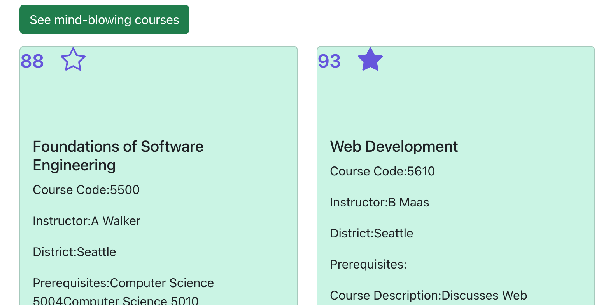

# NEUCourseReviewApp Group Project Iteration 3

## What did Xinyue do:
Create page for reminding user to login when user trying to access myFavoriate page.

## What did Qiuyu do:
1. Make sure the frontend of favorite, mindblowing, and catastrophic tabs are linking to the bad end  
2. Add Code for the mindblowing, and catastrophic tabs. 
My Favorite tab   

Mindblowing tab   

Catastrophic and confusing tab   

## What xiaoxiao did:
1. Complete rolling number funcition. When "favorite a course" backend will be called , the number of favs will increase by one, otherwise decrease by one.

    

2. The animation works correctly with the change of number of favorites

    

## What Yanlin did:
1. Finsh backend part to update the average rating of a course when a new requst created to CRUD review.
Explained as below:
At first there is only one rating of 2 about this course as we can see from database;

then user create a new review with rating of 0.5

the average rating of this course has a change from 2 to 1.25

2. Use DropDown, which is a Bootstrap UI component to allow user to leave comment as anonymous or non-anonymous.

 

# NEUCourseReviewApp Group Project Iteration 2
## What did Xinyue do:
Built homepage and google, microsoft authentication 
Create Search page and let user search by course name or instructor.(configure DB index) 

## What did Qiuyu d0:
Built the frontend of favorite, mindblowing, and catastrophic tabs  
Link the frontend with database  

Motion library   

Start setting up favorite favorite. Please see below screenshot for reference. 

## What xiaoxiao did:

Add counting favorites function to courseList   
Deploy frontend and backend to heroku with teammembers.   

    

    

## What Yanlin did:
Finish page getting reviews for user. Each user's reviews are composed of reviews left as named person or anonymous person. If user doesn't sign in, the page cannot show her/his reviews.

